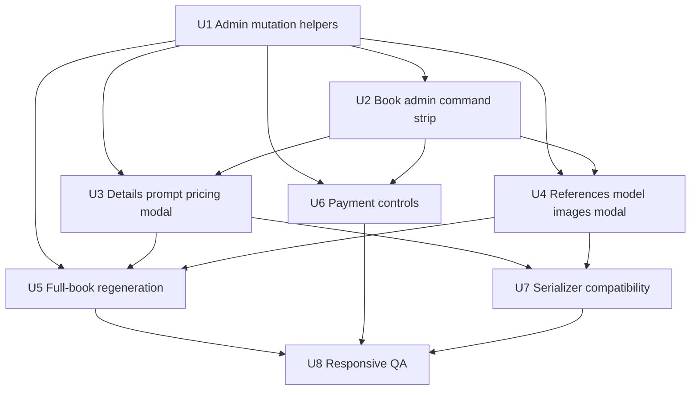

# feat: Admin public book editing

## Overview

Add an authenticated admin mode to the public Book page so an admin can manage the whole client book from the same URL the client sees. The admin can regenerate the entire book, edit prompt details, change pose/style references and client/model reference images, edit pricing, add/remove/toggle payment state, and continue editing individual generated images without exposing any of those controls to public visitors.

| Mode | Visitor state | Expected behavior |
|------|---------------|-------------------|
| Public client | No authenticated Supabase session | Existing Book selection, checkout, paid download, and unpaid copy-protection behavior only. |
| Authenticated admin | Active Supabase session | Existing public view plus admin command strip and editing modals. |
| Paid/partial-paid book | Either visitor state | Public restrictions remain; authenticated admin can correct payment state. |

---

## Problem Frame

The public Book page already loads the current book from Supabase and detects whether the current browser has an authenticated Supabase session. It also has an admin-only image generation modal for adding a new image or editing one image's prompt. The missing behavior is a coherent authenticated admin workspace on that same public page for full-book edits, reference/model changes, pricing changes, and payment correction.

The implementation must respect the existing mobile-first StudioRetrato patterns: compact cards on phone, tables only on desktop admin surfaces, fullscreen mobile modals with scrollable bodies and fixed safe-area footers, and the existing floating cart spacing on Book.

---

## Requirements Trace

- R1. Only an authenticated admin can see and use book-editing controls on the public Book page.
- R2. Public/client users keep the current selection, checkout, copy-protection, and paid-download behavior.
- R3. Admin can regenerate the full book using the current or edited prompt, client/model images, and selected pose/style references.
- R4. Admin can edit `prompt_details` for the book and have future generation use the edited prompt details.
- R5. Admin can edit the pose/style reference set stored in `references_used` and `references_data`.
- R6. Admin can edit the client/model reference images used as identity input for the book.
- R7. Admin can edit pricing fields: package price, package photo count, extra photo price, and price per photo.
- R8. Admin can mark a book or selected photos as paid, remove paid status, and add paid status again without corrupting selected-photo state.
- R9. Admin controls must be mobile-first and compatible with the existing Book/Admin visual system.
- R10. Implementation must be verified with build/lint plus browser checks on mobile and desktop viewports.

---

## Scope Boundaries

- No public self-service editing for clients.
- No new payment provider integration in this feature.
- No redesign of the public Book gallery or checkout flow beyond the admin-only control layer.
- No change to the existing `/admin` route as the primary management dashboard unless shared helpers or parity buttons are needed.
- No destructive replacement of generated photos without confirmation when the full book is regenerated.

---

## Context & Research

### Relevant Code and Patterns

- `src/pages/Book.jsx` already detects admin session with `supabase.auth.getSession()` and `onAuthStateChange`, loads the book from `books`, formats pricing, reads `prompt_details`, `references_data`, and has admin-only add/edit generation modal behavior.
- `src/pages/Book.jsx` has `handleRegeneratePhoto`, `submitAdminGeneration`, Kie AI polling, paid download controls, anti-copy overlay for unpaid photos, and the floating bottom selection panel.
- `src/pages/Admin.jsx` already contains the book creation pipeline, reference selector, prompt details input, pricing validation, `handleMarkAsPaid`, delete photo, variation update, and mobile card vs desktop table patterns.
- `src/services/bookPrompt.js` is the central place for building and sanitizing book generation prompts.
- `src/services/urlSerializer.js` supports legacy/hash book links but does not currently serialize package pricing or `promptDetails`.
- `supabase_schema.sql` and migrations already include `price_per_photo`, `package_price`, `package_photos`, `extra_photo_price`, `references_used`, `references_data`, `photos`, `payment_status`, `selected_photo_ids`, and `prompt_details`.
- `index.html` already contains the durable mobile modal and iPhone safe-area CSS classes used across Admin and Book.

### Institutional Learnings

- Use mobile cards instead of squeezing dense admin actions into phone tables.
- Keep fullscreen mobile modals as `fixed inset-0`, scrollable body, and fixed footer with safe-area padding.
- For public Book, protect the last gallery row from the fixed floating cart by preserving the larger bottom padding.
- Browser validation of admin-only surfaces needs an authenticated session; unauthenticated `/admin` redirects to login.
- `references.category` stores display labels, so category filtering should use category names, not ids.

### External References

- None. Local patterns are sufficient for this plan.

---

## Key Technical Decisions

- Add an admin-only command strip on `Book.jsx`, not a separate admin route, because the requested workflow is editing the public book while viewing the same customer-facing surface.
- Reuse the current Book admin modal shell and Admin wizard patterns instead of creating a new visual system.
- Extract shared book mutation helpers only where it reduces risk around payment and pricing state updates; keep UI state in `Book.jsx`.
- Treat full-book regeneration as a confirmed replacement flow that can either append new generated images or replace the current generated set, with replacement as the explicit destructive choice.
- Keep source-of-truth edits in Supabase `books`; hash payload support remains fallback-only and should not be treated as editable state.
- Payment state must be modeled at both book level and photo level, because current behavior already distinguishes `payment_status` from per-photo `paymentStatus`.

---

## Open Questions

### Resolved During Planning

- Should this live on the public Book page or only `/admin`? It should live on the public Book page because the request targets the public book page for authenticated admins.
- Is external framework research needed? No; the repo already has the relevant Vite/React/Supabase/Kie AI patterns.

### Deferred to Implementation

- Exact admin control layout labels: decide during UI implementation based on available width and screenshot review.
- Whether full-book regeneration defaults to append or replace: implementation should expose both only if it remains clear on mobile; otherwise default to replace with confirmation and keep add-image for append.
- Exact storage cleanup for replaced images: verify current storage paths during implementation before deleting generated files.

---

## Implementation Units

- U1. **Admin book edit state and shared mutation helpers**

**Goal:** Establish safe reusable mutations for updating book pricing, prompt/reference metadata, photo arrays, and payment state.

**Requirements:** R1, R4, R5, R7, R8

**Dependencies:** None

**Files:**
- Create: `src/services/bookAdminActions.js`
- Create: `src/services/bookAdminActions.test.js`
- Modify: `package.json`

**Approach:**
- Add pure helpers for pricing normalization, payment-state transitions, selected-photo reconciliation, and photo replacement/append decisions.
- Keep Supabase writes in page-level handlers, but make the state transformations testable outside React.
- Add the smallest test harness needed for these helpers if no project test runner exists.

**Patterns to follow:**
- `src/pages/Admin.jsx` `calculateTotalPrice`, `validatePricing`, `handleMarkAsPaid`
- `src/pages/Book.jsx` `calculateOutstandingPrice`, `getPaidPhotoIds`

**Test scenarios:**
- Happy path: package book with selected photos inside package -> mark paid sets book `payment_status` to `paid` and selected photo `paymentStatus` to `paid`.
- Happy path: package book with selected photos beyond package count -> mark paid first package photos and leave extra photos pending with `partial_paid`.
- Edge case: unmark paid on a paid book -> book returns to `pending`, per-photo `paymentStatus` is cleared or returned to pending, and `selected_photo_ids` remains intact.
- Edge case: pricing switches from package to per-photo -> package fields are null and `price_per_photo` is valid.
- Error path: incomplete package pricing -> validation returns a blocking error.
- Integration: photo replacement removes stale selected ids that no longer exist in the photo array.

**Verification:**
- Payment, pricing, and photo-array helper tests pass before UI wiring.

---

- U2. **Admin command strip on public Book page**

**Goal:** Add a mobile-first authenticated admin action area to `Book.jsx` with entry points for full regeneration, book details/pricing edit, references/model edit, payment status, and add image.

**Requirements:** R1, R2, R3, R4, R5, R6, R7, R8, R9

**Dependencies:** U1

**Files:**
- Modify: `src/pages/Book.jsx`

**Approach:**
- Replace the current single "Adicionar imagem" admin strip with a compact admin toolbar that appears only when `isAdmin` is true.
- Use icon+text buttons for primary actions on mobile and tighter icon buttons where space is constrained.
- Preserve the public header/status area and floating cart behavior for clients.
- Keep all admin actions above the gallery so the phone user does not need to hunt inside individual photos for global actions.

**Patterns to follow:**
- Existing `isAdmin` guard and `openAdminAddModal` in `src/pages/Book.jsx`
- Mobile action-card rhythm in `src/pages/Admin.jsx`

**Test scenarios:**
- Happy path: authenticated session -> admin command strip is visible and client selection panel remains usable.
- Happy path: unauthenticated visitor -> no admin command strip, no admin buttons on image cards, public flow unchanged.
- Edge case: paid book viewed by admin -> admin can still access edit/payment controls while public selection remains locked.
- Integration: admin command strip does not overlap the fixed selection panel at phone width.

**Verification:**
- Desktop and mobile screenshots show admin controls visible only in authenticated state and no overlap with the floating cart.

---

- U3. **Book details, prompt, and pricing edit modal**

**Goal:** Let an admin edit title, prompt details, and all pricing fields from the public Book page.

**Requirements:** R4, R7, R9

**Dependencies:** U1, U2

**Files:**
- Modify: `src/pages/Book.jsx`
- Test: `src/services/bookAdminActions.test.js`

**Approach:**
- Add a fullscreen mobile modal using the existing `admin-mobile-modal` shell.
- Pre-fill title, prompt details, `pricePerPhoto`, `packagePrice`, `packagePhotos`, and `extraPhotoPrice` from the loaded book.
- Validate the same package-vs-per-photo rules used by Admin before saving.
- Persist to Supabase `books`, then update local `book` state so totals refresh immediately.

**Patterns to follow:**
- `src/pages/Admin.jsx` book wizard step 1 and step 2
- `index.html` admin modal safe-area classes

**Test scenarios:**
- Happy path: edit prompt details -> saved `prompt_details` appears in the Book details card and future generation uses it.
- Happy path: edit package values -> visible package summary and floating cart totals update.
- Edge case: clearing package fields and setting price per photo -> per-photo pricing UI appears.
- Error path: partial package fields -> save is blocked and no Supabase update is attempted.

**Verification:**
- Saved prompt/pricing changes are visible after reload on the same book URL.

---

- U4. **Reference and model image edit modal**

**Goal:** Let an admin change pose/style references and client/model reference images used by the book.

**Requirements:** R5, R6, R9

**Dependencies:** U1, U2

**Files:**
- Modify: `src/pages/Book.jsx`

**Approach:**
- Add a modal with two sections: selected pose/style references and client/model reference images.
- Reuse the reference selector behavior from Admin: category filter by category name, search, card grid with stable aspect ratio, and multi-select state.
- For client/model images, show existing `clientPhotos`, allow upload of new images to the client record, and allow choosing which images are included in the next regeneration input.
- Persist `references_used` and `references_data` to the book record without immediately regenerating unless the admin starts full regeneration.

**Patterns to follow:**
- `src/pages/Admin.jsx` `filteredWizardRefs`, `wizardCategoryFilter`, and reference card grid
- `src/pages/Book.jsx` `uploadAdminFileToStorage`, `uploadAdminInputFiles`

**Test scenarios:**
- Happy path: select a different reference set -> `references_used` and `references_data` are saved and displayed in Book details.
- Happy path: upload new client/model image -> storage URL is added to the client photo set and becomes available for regeneration.
- Edge case: no references selected -> save is blocked if the next full regeneration would have no pose/style references.
- Error path: storage upload fails -> book metadata is not partially rewritten.
- Integration: category filtering uses category names and does not drop valid references.

**Verification:**
- Reloading the Book page shows the edited reference thumbnails and prompt data.

---

- U5. **Full-book regeneration flow**

**Goal:** Allow an admin to regenerate the entire book from the public Book page using the edited prompt, references, and model/client images.

**Requirements:** R3, R4, R5, R6, R9

**Dependencies:** U1, U3, U4

**Files:**
- Modify: `src/pages/Book.jsx`
- Modify: `src/services/bookPrompt.js`
- Test: `src/services/bookAdminActions.test.js`

**Approach:**
- Add a confirmed "Refazer book" action that builds one generation task per selected reference using the same prompt construction rules as Admin.
- Use the current `book.promptDetails`, `book.referencesData`, and chosen client/model images.
- Write pending generated photos to `books.photos` immediately so polling can update them.
- Decide replace vs append through a clear admin choice; if replacing, reconcile `selected_photo_ids` and paid per-photo state.
- Reuse existing Kie AI polling in `Book.jsx` for task completion.

**Patterns to follow:**
- `src/pages/Admin.jsx` `handleCreateBook` generation pipeline
- `src/pages/Book.jsx` Kie AI polling and `submitAdminGeneration`
- `src/services/bookPrompt.js` `buildBookGenerationPrompt` and `buildBookMasterPrompt`

**Test scenarios:**
- Happy path: regenerate whole book with three references -> three pending photos are saved with task ids and matching reference metadata.
- Happy path: failed generation task creation -> failed photo placeholder is saved with error text without aborting every other reference.
- Edge case: replace current photos -> removed photo ids are also removed from selected ids.
- Edge case: existing paid photos during replace -> destructive confirmation is required before replacing.
- Error path: no client/model image available -> regeneration is blocked with an admin-visible error.
- Integration: polling updates generated photos in Supabase and local state after task success.

**Verification:**
- Admin starts full regeneration, sees generating cards immediately, and successful Kie results replace pending placeholders.

---

- U6. **Payment controls on public Book page**

**Goal:** Let an admin add, remove, and correct paid state directly on the public Book page.

**Requirements:** R8, R9

**Dependencies:** U1, U2

**Files:**
- Modify: `src/pages/Book.jsx`
- Test: `src/services/bookAdminActions.test.js`

**Approach:**
- Add admin-only payment controls that can mark the selected set as paid, mark the full book paid, mark only package photos paid, or remove paid status.
- Keep the public/client restrictions intact: clients cannot change selection on paid photos or paid books.
- Update both `payment_status` and per-photo `paymentStatus` consistently.
- Show state clearly in the existing status pill and image badges.

**Patterns to follow:**
- `src/pages/Admin.jsx` `handleMarkAsPaid`
- `src/pages/Book.jsx` `togglePhotoSelection`, paid download logic, and lightbox download logic

**Test scenarios:**
- Happy path: admin marks selected photos paid -> paid badges appear and download buttons are enabled for those photos.
- Happy path: admin removes paid status -> badges disappear and unpaid copy protection returns.
- Edge case: partial package payment -> package photos remain paid and extra selected photos remain pending.
- Error path: no selected photos and action requires selection -> action is blocked.
- Integration: after reload, status pill, floating total, image overlays, and lightbox controls match persisted state.

**Verification:**
- Payment toggles work from the public Book page and from reload state without requiring `/admin`.

---

- U7. **Serializer compatibility and legacy link fallback**

**Goal:** Keep hash/legacy book links usable while ensuring new editable fields are preserved when copied or decoded.

**Requirements:** R2, R4, R5, R7

**Dependencies:** U3, U4

**Files:**
- Modify: `src/services/urlSerializer.js`
- Create: `src/services/urlSerializer.test.js`

**Approach:**
- Add package pricing and `promptDetails` fields to encoded payloads.
- Preserve backward compatibility for old payloads by defaulting missing fields safely.
- Continue treating Supabase as the preferred source when a book id is available.

**Patterns to follow:**
- Existing compact key serializer in `src/services/urlSerializer.js`

**Test scenarios:**
- Happy path: encode/decode book with package pricing, prompt details, selected ids, and references -> fields round-trip.
- Edge case: decode old payload without package fields -> returns usable book with existing defaults/nulls.
- Error path: malformed payload -> returns null without throwing to UI.

**Verification:**
- Copied book links still open after the serializer change.

---

- U8. **Responsive QA and production-safe verification**

**Goal:** Verify the new admin editing layer across mobile, desktop, authenticated, unauthenticated, paid, unpaid, partial-paid, and generation states.

**Requirements:** R1, R2, R9, R10

**Dependencies:** U2, U3, U4, U5, U6, U7

**Files:**
- Modify: `README.md` only if a new test script or admin QA note is introduced.

**Approach:**
- Run lint/build and any added unit tests.
- Start local Vite dev server and browser-check the Book page at mobile and desktop widths.
- Verify unauthenticated public access separately from authenticated admin access.
- Confirm `/admin` still redirects unauthenticated users and still shows existing mobile cards when authenticated.

**Patterns to follow:**
- Existing Vite workflow in `package.json`
- Existing StudioRetrato deploy validation pattern after implementation if the user asks to publish

**Test scenarios:**
- Public mobile: no admin controls, no overlap with floating cart, selection flow works.
- Public desktop: gallery, pricing, checkout modal, and lightbox remain stable.
- Admin mobile: command strip, modals, fixed footers, scrolling bodies, and file inputs remain usable.
- Admin desktop: command strip and modals fit without crowding the gallery.
- Paid state: public cannot modify paid selections; admin can correct status.
- Generation state: pending/failed/success cards remain coherent during full-book regeneration.

**Verification:**
- Build, lint, unit tests, and browser screenshots pass before final handoff.

---

## System-Wide Impact

- **Interaction graph:** `Book.jsx` becomes the primary public/admin hybrid surface. It will read auth state, fetch book data, fetch references/categories for admin editing, write book updates, upload model/client images, create Kie tasks, and poll generation status.
- **Error propagation:** Supabase, storage, and Kie errors must surface inside admin modals without mutating local book state as if the save succeeded.
- **State lifecycle risks:** Full regeneration can invalidate selected ids and paid per-photo state; helper tests must lock down reconciliation behavior.
- **API surface parity:** `/admin` book management should still work; shared helper behavior should not diverge from existing Admin payment semantics.
- **Integration coverage:** Browser checks must cover authenticated and unauthenticated Book states because admin controls are session-dependent.
- **Unchanged invariants:** Public visitors can view/select unpaid photos, submit selection, and download only paid photos exactly as before.

---

## Risks & Dependencies

| Risk | Mitigation |
|------|------------|
| Admin controls leak to public users | Gate every admin action by `isAdmin` and keep Supabase RLS as the second line of defense. |
| Full regeneration destroys paid/selected state accidentally | Require confirmation and reconcile ids through tested helpers. |
| Mobile admin UI becomes cramped | Use fullscreen modal shell, fixed footer, scrollable body, and compact action cards/buttons. |
| Pricing edits create invalid totals | Reuse package/per-photo validation and test helper outcomes. |
| Reference/model edits partially save after upload failure | Upload first, then persist metadata in one book/client update sequence. |
| Serializer change breaks old links | Add backward-compatible decode tests. |

---

## Documentation / Operational Notes

- No production deploy is part of this plan unless requested after implementation.
- If a new test runner is added, document the script in `README.md` or keep it discoverable in `package.json`.
- Browser QA must use an authenticated session before judging admin-only UI.

---

## Sources & References

- Related code: `src/pages/Book.jsx`
- Related code: `src/pages/Admin.jsx`
- Related code: `src/services/bookPrompt.js`
- Related code: `src/services/urlSerializer.js`
- Related schema: `supabase_schema.sql`
- Related migrations: `supabase/migrations/20260625121000_add_pricing_columns_to_books.sql`
- Related migrations: `supabase/migrations/20260625140000_add_prompt_details_to_books.sql`
- Related styles: `index.html`
